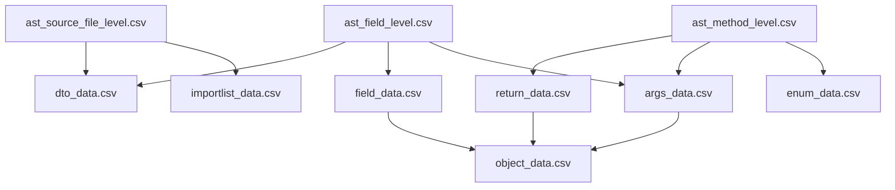

# F303.ツール詳細設計書 別冊1.CSV定義

- システム名：AST-TOOLS
- 対象ツール：`java_ast`、`java_ast_cleaner`
- 文書種別：CSV詳細仕様書
- 作成日：2026-08-14
- 文字コード：UTF-8（BOMなし）

---

## 1. 目的

本書は、`java_ast`が出力する3種類のAST CSVと、`java_ast_cleaner`が出力する7種類の正規化CSVについて、現行実装および確認用実CSVに即して次を定義する。

- CSVごとの目的と1行の単位
- 全列の値、用途およびデータ型
- 列値ごとの意味
- センチネル値の意味
- CSV間の参照関係
- 木構造として解釈する列の規則
- 確認用実CSVで観測された件数と値域

本書における「実CSV」は、2026-08-10生成分として提供されたCSV一式を指す。実CSVに値が存在しない機能は、実装上の定義と実データで未確認であることを区別して記載する。

---

## 2. CSV全体仕様

### 2.1 ファイル一覧

| 出力元 | CSV | 1行の単位 | 実CSVデータ行数 |
|---|---|---|---:|
| `java_ast` | `ast_source_file_level.csv` | ファイルスコープまたはクラススコープ | 140 |
| `java_ast` | `ast_method_level.csv` | メソッドルート、制御構造またはenum列挙子ページ | 262 |
| `java_ast` | `ast_field_level.csv` | クラスフィールドまたはメソッド引数 | 560 |
| `java_ast_cleaner` | `importlist_data.csv` | import 1件 | 476 |
| `java_ast_cleaner` | `enum_data.csv` | enum列挙子1件 | 0 |
| `java_ast_cleaner` | `args_data.csv` | メソッド／コンストラクタ引数1件 | 401 |
| `java_ast_cleaner` | `field_data.csv` | クラスフィールド1件 | 159 |
| `java_ast_cleaner` | `dto_data.csv` | 既知クラスに属するフィールド1件 | 159 |
| `java_ast_cleaner` | `return_data.csv` | メソッド／コンストラクタ1件 | 204 |
| `java_ast_cleaner` | `object_data.csv` | 引数・フィールド・戻り値の型構造ノード1件 | 562 |

### 2.2 文字・CSV形式

| 項目 | 仕様 |
|---|---|
| 文字コード | UTF-8（BOMなし） |
| 区切り文字 | カンマ`,` |
| ヘッダー | 1行目に必ず出力 |
| 引用 | カンマ、ダブルクォート、CRまたはLFを含む値はダブルクォートで囲む |
| ダブルクォート | CSVセル内では`""`へ二重化する |
| セル内改行 | 引用セル内の値として保持する |
| 数値 | 10進整数文字列として出力する |
| 改行 | CSVパーサーで論理行として読み込み、物理行数で件数を判断しない |

`role`等にはセル内改行が存在し得るため、`wc -l`等による物理行数はCSVレコード数と一致しない場合がある。

### 2.3 共通センチネル

センチネルは列の文脈によって意味が異なる。単独の値だけで判断せず、対象CSVおよび列定義と組み合わせて解釈する。

| 値 | 主な意味 |
|---|---|
| `-` | 文字列値の該当なし、未指定、格納対象外 |
| `-1` | 数値値の該当なし、判定不能、参照なし、非適用 |
| `0` | 件数ゼロ、未使用の木構造座標、またはboolean相当の偽 |
| 空文字 | AST CSVでは列種別により実値として出力される場合がある。Cleanerの文字列列では原則`-`へ正規化される |

### 2.4 CSV間の関係



`object_data.csv`は、`args_data.csv`、`field_data.csv`、`return_data.csv`の正の`objectRootId`から参照する。

---

## 3. `ast_source_file_level.csv`

### 3.1 目的と行生成規則

Javaファイルと、そのファイル内で検出したクラス、interface、enumの構成情報を出力する。

1つのJavaファイルにつき、次の行を生成する。

1. `className=-`のファイルスコープ行を必ず1行生成する。
2. 検出したクラス、interface、enumごとにクラススコープ行を1行生成する。
3. ネストされたクラス、interface、enumも個別のクラススコープ行とする。

### 3.2 列定義

| 列 | 型 | 目的・内容 | センチネル・特記事項 |
|---|---|---|---|
| `appName` | string | Configの`targetAppName`。解析対象アプリケーションの識別名 | センチネルなし |
| `fileName` | string | 拡張子を含むJavaファイル名 | センチネルなし |
| `directoryPath` | string | `targetAppDir`からファイル親ディレクトリまでの相対パス。通常`./`で始まる | 相対化失敗時は絶対パスへフォールバック |
| `className` | string | クラス、interfaceまたはenumの単純名 | `-`はファイルスコープ行 |
| `importList` | string | 当該Javaファイルのimport文全文をソース順に` / `で連結した文字列 | importなしは`-`。クラススコープ行も非適用のため`-` |
| `lineCount` | int | CompilationUnit終端の行番号 | クラススコープ行は非適用のため`-1`。終端位置を取得できない場合は`0` |
| `methodCount` | int | クラススコープ行では、その宣言が直接持つコンストラクタ数＋メソッド数 | ファイルスコープ行はJavaにトップレベル関数がないため`0` |
| `variableCount` | int | クラススコープ行では、`final`でないフィールド変数宣言数 | ファイルスコープ行は`0`。`int a,b;`は2件と数える |
| `constantCount` | int | クラススコープ行では、`final`フィールド変数宣言数。enumでは列挙子数も加算する | ファイルスコープ行は`0` |

### 3.3 行種別ごとの値

| 行種別 | `className` | `importList` | `lineCount` | `methodCount` | `variableCount` | `constantCount` |
|---|---|---|---:|---:|---:|---:|
| ファイルスコープ | `-` | import全文または`-` | 実行数 | `0` | `0` | `0` |
| クラス／interface | 宣言名 | `-` | `-1` | 直接宣言数 | 非finalフィールド数 | finalフィールド数 |
| enum | enum名 | `-` | `-1` | 直接宣言数 | 非finalフィールド数 | finalフィールド数＋列挙子数 |

### 3.4 実CSV確認結果

- データ行：140行
- ファイルスコープ行：70行
- クラススコープ行：70行
- クラス行の`methodCount`合計：204

---

## 4. `ast_method_level.csv`

### 4.1 目的

メソッドまたはコンストラクタをルートとする制御構造ツリー、メソッド属性および引数宣言を表現する。

本CSVは完全なJava ASTではなく、後段利用に必要な制御構造だけを抽出した処理構造CSVである。代入、変数宣言、メソッド呼出し、`return`、三項演算子、`&&`および`||`自体は処理構造ノードとして出力しない。

### 4.2 行種別

| 行種別 | 判定条件 | 内容 |
|---|---|---|
| 引数／ルート代表行 | `processContent=引数` | メソッドまたはコンストラクタのルートと引数一覧を表す |
| 制御構造行 | `processContent`が制御構造文字列 | `if`、`for`、`try`等の制御構造ノードを表す |
| enum行 | `processContent=enum` | 最大20件単位のenum列挙子ページを表す |
| クラスなしファイル代表行 | 全`processN=0` | クラスもenumもないファイルを表す。実CSVには存在しない |

### 4.3 共通識別列

| 列 | 型 | 目的・内容 | センチネル・特記事項 |
|---|---|---|---|
| `filePath` | string | `targetAppDir`からJavaファイルまでの相対パス。通常`./`で始まる | 相対化失敗時は絶対パスへフォールバック |
| `className` | string | クラス、interfaceまたはenumの単純名 | クラスなしファイル代表行では拡張子付きファイル名 |
| `methodName` | string | メソッド名 | コンストラクタは`Constructor{process1}`。クラスなし代表行は`-` |

### 4.4 `process1`～`process9`

9列を一体の木構造座標として扱う。個別列が独立した属性を表すものではない。

| 列 | 型 | 目的・内容 |
|---|---|---|
| `process1` | int | クラス内のメソッド／コンストラクタルート番号。コンストラクタを先、メソッドを後として1から採番 |
| `process2` | int | ルート直下の制御構造の兄弟番号 |
| `process3` | int | `process2`ノード直下の制御構造の兄弟番号 |
| `process4` | int | `process3`ノード直下の制御構造の兄弟番号 |
| `process5` | int | `process4`ノード直下の制御構造の兄弟番号 |
| `process6` | int | `process5`ノード直下の制御構造の兄弟番号 |
| `process7` | int | `process6`ノード直下の制御構造の兄弟番号 |
| `process8` | int | `process7`ノード直下の制御構造の兄弟番号 |
| `process9` | int | `process8`ノード直下の制御構造の兄弟番号 |

#### 通常座標の規則

- `0`は、その深さを使用していないことを表すゼロ埋めである。
- 通常ノードの親座標は、最も深い非ゼロ座標を`0`に戻して求める。
- 同じ親を持つ兄弟番号は、ソース走査順に`1`から連続する。
- `process1`はクラスごとに採番をリセットする。
- メソッド／コンストラクタルートの代表座標は`(process1,0,0,0,0,0,0,0,0)`である。
- 10階層目以降の制御構造は出力しない。

例：

```text
(9,0,0,0,0,0,0,0,0)  メソッドルート
(9,1,0,0,0,0,0,0,0)  ルートの第1子
(9,1,1,0,0,0,0,0,0)  第1子の第1子
(9,1,2,0,0,0,0,0,0)  第1子の第2子
```

#### enum専用座標

- `process2=-1`はenum列挙子行の専用マーカーである。
- `process3`は20件単位のページ番号で、0から始まる。
- `process4`～`process9`は`0`である。
- 通常の制御構造ツリーとして親を求めない。

#### クラスなしファイル代表座標

- `process1`～`process9`をすべて`0`とする。
- 実CSVには該当行がない。

### 4.5 処理内容・メソッド属性列

| 列 | 型 | 目的・内容 | センチネル・値 |
|---|---|---|---|
| `processContent` | string | 行が表す制御構造または特殊行種別 | `引数`、`enum`、制御構造文字列。クラスなし代表行は空文字 |
| `role` | string | Javadocコメント全文をトリムして格納 | Javadocなしは`記載なし` |
| `returnType` | string | メソッドの戻り値型の生テキスト | コンストラクタ、enum行、クラスなし代表行は`-` |
| `methodType` | string | メソッド特性。該当する値を`+`で連結 | `静的`、`抽象`、`synchronized`、`final`。該当なしおよびコンストラクタは`-` |
| `accessModifier` | string | JavaParserが取得した全Modifierを空白区切りで格納 | Modifierなしは`-`。アクセス修飾子だけの列ではない |

#### `processContent`の制御構造値

| Java構造 | 値の形式 |
|---|---|
| if | `if (条件式)` |
| else-if | `else if (条件式)` |
| else | `else` |
| 通常for | `for (初期化; 条件; 更新)` |
| 拡張for | `for (変数 : iterable)` |
| while | `while (条件式)` |
| do-while | `do {} while (条件式)` |
| switch entry | `case 値:`または`default:` |
| try | `try` |
| catch | `catch (例外引数)` |
| finally | `finally` |

`if`、`else if`、`else`は同じ親を持つ兄弟ノードとして出力する。switchの各entry、`try`、各`catch`、`finally`もそれぞれ同じ深さの兄弟ノードとなる。

### 4.6 `arg1`～`arg20`

`arg1`～`arg20`は行種別によって用途が切り替わる、20個の順序付きペイロード列である。

| 行種別 | `argN`の意味 | 未使用列 |
|---|---|---|
| `processContent=引数` | N番目のJava引数宣言全体 | `-` |
| `processContent=enum` | そのページ内のN番目のenum列挙子名 | `-` |
| 制御構造行 | 使用しない | 全列`-` |
| クラスなし代表行 | 使用しない | 全列`-` |

引数行の`argN`には、存在する場合、次を含む引数宣言全体を1セルに保持する。

- 引数アノテーション
- `final`等の引数Modifier
- 型およびジェネリック型構文
- 配列または可変長引数構文
- 引数名

例：

```text
@RequestParam(value = "format", defaultValue = "csv") String format
```

アノテーションやジェネリック型内のカンマはCSV引用規則で保護され、複数の`argN`へ分割されない。第21引数以降は出力しない。

enum行の全体インデックスはCleanerで次の式により求める。

```text
enumIndex = process3 × 20 + N
```

### 4.7 実CSV確認結果

| 項目 | 件数・値 |
|---|---:|
| 全行 | 262 |
| 引数／ルート代表行 | 204 |
| 制御構造行 | 58 |
| enum行 | 0 |
| クラスなしファイル代表行 | 0 |
| 最大観測制御階層 | `process5` |
| 非空`argN`総数 | 401 |
| 最大観測引数数 | 6 |

全204ルートに引数専用行がちょうど1行存在し、通常制御ノード58件には重複座標、親なし座標および兄弟番号の欠番が存在しなかった。

---

## 5. `ast_field_level.csv`

### 5.1 目的と行生成規則

クラス／enumフィールドと、メソッド／コンストラクタ引数を同一形式で出力する。

- フィールド宣言は変数単位で1行とする。`int a,b;`は2行となる。
- メソッド／コンストラクタ引数は引数単位で1行とする。
- enum列挙子自体は本CSVのフィールド行には含めない。

### 5.2 列定義

| 列 | 型 | 目的・内容 | センチネル・値 |
|---|---|---|---|
| `filePath` | string | 対象Javaファイルの相対パス | 相対化失敗時は絶対パス |
| `className` | string | 所有クラス、interfaceまたはenumの単純名 | センチネルなし |
| `methodName` | string | 引数を所有するメソッド名または`Constructor{process1}` | `fieldKind=field`では空文字 |
| `fieldKind` | string | 行種別 | `field`または`parameter` |
| `fieldName` | string | フィールド名または引数名 | センチネルなし |
| `fieldType` | string | JavaParserが取得した型の生テキスト | センチネルなし |
| `isFinal` | int | final指定の有無 | `1`はfinal、`0`は非final |
| `validationMin` | int | `@Min`または`@Size(min=...)`から取得した下限 | `-1`は対象アノテーションなし、指定値の整数化失敗、または実値`-1` |
| `validationMax` | int | `@Max`または`@Size(max=...)`から取得した上限 | `-1`は対象アノテーションなし、指定値の整数化失敗、または実値`-1` |
| `nullable` | int | null許容性アノテーションの明示状態 | `0`は非null、`1`はnullable、`-1`は判定不能／明示なし |
| `rawAnnotations` | string | 対象に付与された全アノテーションの生テキストを空白区切りで連結 | アノテーションなしは`-` |

### 5.3 `nullable`判定

| 検出アノテーション | 出力値 |
|---|---:|
| `@NotNull` | `0` |
| `@NotBlank` | `0` |
| `@NotEmpty` | `0` |
| `@Nullable` | `1` |
| 上記なし | `-1` |

複数存在する場合は、実装の走査順で最初に一致したアノテーションの結果を使用する。

### 5.4 実CSV確認結果

| 行種別 | 件数 |
|---|---:|
| `parameter` | 401 |
| `field` | 159 |
| 合計 | 560 |

- `validationMin/Max`に実境界値があったのは`ConnectionSettingRequest.dbPort`の`1`および`65535`である。
- 残る559行は両列とも`-1`である。
- `nullable=0`は29件ですべてフィールド行、`nullable=-1`は531件、`nullable=1`は0件である。

---

## 6. `importlist_data.csv`

### 6.1 目的と行生成規則

`ast_source_file_level.csv`のファイルスコープ行にまとめて格納されたimport文を、import 1件につき1行へ展開する。

入力行を`appName`、`fileName`、`directoryPath`の昇順に並べ、`importList`を` / `で分割し、先頭の`import `と末尾の`;`を除去する。

### 6.2 列定義

| 列 | 型 | 目的・内容 | センチネル・特記事項 |
|---|---|---|---|
| `n` | int | 出力順に1から採番する実行内連番 | センチネルなし。永続的な識別子ではない |
| `appName` | string | 入力元の`appName` | 空値は`-`へ正規化 |
| `fileName` | string | importを持つJavaファイル名 | 空値は`-`へ正規化 |
| `directoryPath` | string | importを持つJavaファイルのディレクトリ | 空値は`-`へ正規化 |
| `importList` | string | `import`と`;`を除去した1件のimport対象 | 空値と`-`は行を生成しない |

### 6.3 実CSV確認結果

- 476行
- AST CSVから再構成した行・順序と476件すべて一致

---

## 7. `enum_data.csv`

### 7.1 目的と行生成規則

`ast_method_level.csv`の`processContent=enum`行に格納された列挙子を、列挙子1件につき1行へ展開する。

### 7.2 列定義

| 列 | 型 | 目的・内容 | センチネル・特記事項 |
|---|---|---|---|
| `n` | int | 出力順に1から採番する実行内連番 | センチネルなし |
| `filePath` | string | enum宣言を含むJavaファイル | 空値は`-`へ正規化 |
| `enumName` | string | 入力元の`className`、すなわちenum名 | 空値は`-`へ正規化 |
| `enumIndex` | int | enum内の1始まり列挙子番号 | `process3 × 20 + arg列番号` |
| `enumValue` | string | enum列挙子名 | 空または`-`の`argN`は行を生成しない |
| `convModel` | string | 言語共通型 | `ENUM`固定 |

### 7.3 実CSV確認結果

ヘッダーのみでデータ行は0件である。列値とページ境界は実装上定義されているが、今回の実CSVでは未確認である。

---

## 8. `args_data.csv`

### 8.1 目的と行生成規則

`ast_method_level.csv`の引数専用行にある非空・非`-`の`arg1`～`arg20`を、JavaParserで再解析し、引数1件につき1行へ展開する。検証境界、nullableおよびアノテーションは`ast_field_level.csv`のparameter行と結合する。

### 8.2 列定義

| 列 | 型 | 目的・内容 | センチネル・特記事項 |
|---|---|---|---|
| `n` | int | 出力順に1から採番する実行内連番 | センチネルなし |
| `filePath` | string | 引数を所有するJavaファイル | 空値は`-`へ正規化 |
| `className` | string | 引数を所有するクラス名 | 空値は`-`へ正規化 |
| `methodName` | string | 引数を所有するメソッド名または`Constructor{process1}` | 空値は`-`へ正規化 |
| `process1` | int | 所有メソッド／コンストラクタのクラス内ルート番号 | 入力欠落・非数値はCleaner全体の整数正規化でエラーとなる。代替行の既定は`-1` |
| `argIndex` | int | 1始まりの引数宣言順。元の`argN`のN | `1`～`20` |
| `argName` | string | JavaParserで取得した引数名 | 引数解析失敗時は`-` |
| `argRaw` | string | 元の`argN`に格納された引数宣言全文 | 解析失敗時も元文字列を保持 |
| `rawType` | string | JavaParserで取得した引数型の生テキスト | 引数解析失敗時は`-` |
| `convModel` | string | 型対応表で変換した言語共通型 | 未登録型および引数解析失敗時は`OBJECT` |
| `validationMin` | int | 対応parameter行の下限 | 結合先なしは`-1`。入力側センチネルの意味も継承 |
| `validationMax` | int | 対応parameter行の上限 | 結合先なしは`-1`。入力側センチネルの意味も継承 |
| `nullable` | int | 対応parameter行のnull許容状態 | 結合先なしは`-1` |
| `rawAnnotations` | string | 対応parameter行のアノテーション全文 | 結合先なしは`-` |
| `objectRootId` | int | `object_data.csv`に生成した型ツリールートの`objectId` | 型ツリー不要または引数解析失敗は`-1` |

### 8.3 `argRaw`の分解例

```text
argRaw         = @Validated @RequestBody ConnectionSettingRequest request
argName        = request
rawType        = ConnectionSettingRequest
rawAnnotations = @Validated @RequestBody
convModel      = OBJECT
```

`rawAnnotations`は`argRaw`から直接出力した値ではなく、対応する`ast_field_level.csv`のparameter行から結合した値である。

### 8.4 型ツリー生成条件

次のいずれかに該当する引数型は`object_data.csv`へ型ツリーを生成する。

- 配列型
- 型引数を持つクラス／interface型
- `convModel=OBJECT`となるクラス／interface型

primitiveや、`STRING`、`NUMBER`等に変換される型引数なしの単純型は`objectRootId=-1`となる。

### 8.5 実CSV確認結果

| 項目 | 件数 |
|---|---:|
| 全引数 | 401 |
| 正の`objectRootId` | 116 |
| `objectRootId=-1` | 285 |

正のルート116件は、`convModel=OBJECT`が91件、`COLLECTION`が24件、`MAP`が1件である。引数解析失敗の代替行は0件であり、ASTの`argN`から再構成した401件と順序を含め完全一致した。

---

## 9. `field_data.csv`

### 9.1 目的と行生成規則

`ast_field_level.csv`の`fieldKind=field`行をクラスフィールド1件につき1行へ変換し、`convModel`と型ツリー参照を追加する。parameter行は対象外である。

### 9.2 列定義

| 列 | 型 | 目的・内容 | センチネル・特記事項 |
|---|---|---|---|
| `n` | int | 出力順に1から採番する実行内連番 | センチネルなし |
| `filePath` | string | フィールドを所有するJavaファイル | 空値は`-`へ正規化 |
| `className` | string | フィールドを所有するクラス名 | 空値は`-`へ正規化 |
| `fieldName` | string | フィールド名 | 空値は`-`へ正規化 |
| `rawType` | string | 入力元`fieldType` | 空値は`-`へ正規化 |
| `convModel` | string | 型対応表で変換した言語共通型 | 未登録型または型解析失敗時は`OBJECT` |
| `isFinal` | int | final指定の有無 | `1`はfinal、`0`は非final |
| `validationMin` | int | 入力元の下限 | 入力元センチネルを継承 |
| `validationMax` | int | 入力元の上限 | 入力元センチネルを継承 |
| `nullable` | int | 入力元のnull許容状態 | 入力元センチネルを継承 |
| `rawAnnotations` | string | 入力元のアノテーション全文 | アノテーションなしは`-` |
| `objectRootId` | int | `object_data.csv`に生成した型ツリールートの`objectId` | 型ツリー不要または型解析失敗は`-1` |

### 9.3 実CSV確認結果

| 項目 | 件数 |
|---|---:|
| 全フィールド | 159 |
| 正の`objectRootId` | 58 |
| `objectRootId=-1` | 101 |

正のルート58件は、`convModel=OBJECT`が45件、`COLLECTION`が11件、`MAP`が2件である。ASTフィールド159件と構造・値が一致した。

---

## 10. `dto_data.csv`

### 10.1 目的と現行の行生成規則

名称はDTOデータであるが、現行実装はDTO種別を判定していない。

`ast_source_file_level.csv`の非`-`の`className`を既知クラス名として収集し、`ast_field_level.csv`の`fieldKind=field`行のうち、所有クラス名が既知クラス名に含まれるフィールドを1行ずつ出力する。

したがって、現行CSVが表す正確な内容は「ASTで検出した既知クラスに属するフィールドの簡易一覧」である。

### 10.2 列定義

| 列 | 型 | 目的・内容 | センチネル・特記事項 |
|---|---|---|---|
| `n` | int | 出力順に1から採番する実行内連番 | センチネルなし |
| `filePath` | string | フィールドを所有するJavaファイル | 空値は`-`へ正規化 |
| `dtoName` | string | 入力元の所有クラス名 | DTOであることを保証しない |
| `fieldName` | string | フィールド名 | 空値は`-`へ正規化 |
| `rawType` | string | 入力元`fieldType` | 空値は`-`へ正規化 |

### 10.3 実CSV確認結果

- 159行
- `ast_field_level.csv`のfield行159件と1対1
- Controller等、DTO以外のクラスフィールドも含む

---

## 11. `return_data.csv`

### 11.1 目的と行生成規則

`ast_method_level.csv`の引数専用行を代表行として、メソッド／コンストラクタ1件につき1行の戻り値情報を出力する。

重複排除キーは次の4項目である。

```text
filePath + className + methodName + process1
```

戻り値を持つメソッドだけでなく、`void`メソッドおよびコンストラクタも対象となる。

### 11.2 列定義

| 列 | 型 | 目的・内容 | センチネル・特記事項 |
|---|---|---|---|
| `n` | int | 出力順に1から採番する実行内連番 | センチネルなし |
| `filePath` | string | メソッドを所有するJavaファイル | 空値は`-`へ正規化 |
| `className` | string | メソッドを所有するクラス名 | 空値は`-`へ正規化 |
| `methodName` | string | メソッド名または`Constructor{process1}` | 空値は`-`へ正規化 |
| `process1` | int | 所有メソッド／コンストラクタのクラス内ルート番号 | 入力欠落時の既定は`-1` |
| `rawType` | string | ASTメソッド行の`returnType` | コンストラクタは`-`。`void`は文字列`void` |
| `convModel` | string | 戻り値型の言語共通型 | コンストラクタは`-`。未登録型および型解析失敗時は`OBJECT` |
| `objectRootId` | int | `object_data.csv`に生成した戻り値型ツリールートの`objectId` | 型ツリー不要、コンストラクタまたは型解析失敗は`-1` |

### 11.3 代表的な値の組合せ

| 対象 | `rawType` | `convModel` | `objectRootId` |
|---|---|---|---:|
| コンストラクタ | `-` | `-` | `-1` |
| `void`メソッド | `void` | 現行型対応では`OBJECT` | `-1` |
| 単純な既知型 | Java型 | 対応する共通型 | `-1` |
| 単純な業務オブジェクト | Java型 | `OBJECT` | 正のID |
| 配列・ジェネリック型 | Java型 | 外側の共通型 | 正のID |

### 11.4 実CSV確認結果

| 項目 | 件数 |
|---|---:|
| 全行 | 204 |
| 正の`objectRootId` | 141 |
| `objectRootId=-1` | 63 |
| `void` | 38 |
| コンストラクタ | 1 |

`ast_method_level.csv`の引数専用行204件と1対1であり、所有キーの重複はなかった。

---

## 12. `object_data.csv`

### 12.1 目的

引数、クラスフィールドおよび戻り値の型を、親子関係を持つ型構造ツリーとして表現する。

`ast_method_level.csv`の`process1`～`process9`が表す制御構造ツリーとは別の木構造である。

### 12.2 型ツリー生成条件

次の型に対してルートノードを生成する。

- 配列型
- 型引数を持つクラス／interface型
- `convModel=OBJECT`のクラス／interface型

ルートノードの`objectId`を、所有元CSVの`objectRootId`へ設定する。

### 12.3 列定義

| 列 | 型 | 目的・内容 | センチネル・値 |
|---|---|---|---|
| `objectId` | int | 実行中に全型ノードへ1から付与する一意連番 | センチネルなし。実行をまたぐ恒久IDではない |
| `parentObjectId` | int | 親型ノードの`objectId` | ルートノードは`-1` |
| `ownerKind` | string | 型ツリーの生成元 | `ARG`、`FIELD`、`RETURN` |
| `filePath` | string | 所有元Javaファイル | 空値は`-`へ正規化 |
| `className` | string | 所有元クラス名 | 空値は`-`へ正規化 |
| `methodName` | string | ARG／RETURNの所有メソッド名 | FIELDでは`-` |
| `ownerName` | string | ARGは引数名、FIELDはフィールド名、RETURNは`return` | 空値は`-`へ正規化 |
| `ownerIndex` | int | ARGでは元の`argN`のN | FIELD／RETURNは`-1` |
| `position` | string | 親に対する型ノードの位置 | `ROOT`、`ELEMENT`、`KEY`、`VALUE` |
| `rawType` | string | 当該ノードが表すJava型構文 | センチネルなし |
| `baseType` | string | 型引数等を除いた基底型 | 配列は`[]`、primitiveは型名、クラス型は単純名 |
| `convModel` | string | 当該ノードの言語共通型 | 未登録型は`OBJECT` |
| `referenceType` | string | `convModel=OBJECT`ノードの参照型名 | `OBJECT`以外は`-` |

### 12.4 `position`の意味

| 値 | 意味 |
|---|---|
| `ROOT` | 所有元の`objectRootId`が直接参照する型 |
| `ELEMENT` | 配列要素、またはMap以外のジェネリック型引数 |
| `KEY` | `convModel=MAP`である型の第1型引数 |
| `VALUE` | `convModel=MAP`である型の第2型引数 |

### 12.5 型別展開規則

| 型 | 子ノード |
|---|---|
| 配列 | コンポーネント型を`ELEMENT`として1件生成 |
| Map | 第1型引数を`KEY`、第2型引数を`VALUE`として生成 |
| Map以外のジェネリック型 | 各型引数を`ELEMENT`として生成 |
| 型引数なしのOBJECT | 子ノードなし |

ワイルドカード型は次の順で正規化してから子ノード化する。

1. `? extends T`は`T`
2. `? super T`は`T`
3. 無境界`?`は`Object`

### 12.6 型ツリー例

元の戻り値型：

```java
ResponseEntity<List<Map<String, Object>>>
```

| objectId | parentObjectId | position | rawType | baseType | convModel | referenceType |
|---:|---:|---|---|---|---|---|
| 327 | -1 | ROOT | `ResponseEntity<List<Map<String, Object>>>` | `ResponseEntity` | `OBJECT` | `ResponseEntity` |
| 328 | 327 | ELEMENT | `List<Map<String, Object>>` | `List` | `COLLECTION` | `-` |
| 329 | 328 | ELEMENT | `Map<String, Object>` | `Map` | `MAP` | `-` |
| 330 | 329 | KEY | `String` | `String` | `STRING` | `-` |
| 331 | 329 | VALUE | `Object` | `Object` | `OBJECT` | `Object` |

### 12.7 実CSV確認結果

| 項目 | 件数 |
|---|---:|
| 全型ノード | 562 |
| ルートノード | 315 |
| 子孫ノード | 247 |
| `ownerKind=ARG` | 168 |
| `ownerKind=FIELD` | 92 |
| `ownerKind=RETURN` | 302 |
| `position=ROOT` | 315 |
| `position=ELEMENT` | 153 |
| `position=KEY` | 47 |
| `position=VALUE` | 47 |

実CSVでは次の参照整合性を確認した。

- `objectId`は1～562の連続値
- 全非ルートノードの`parentObjectId`が実在
- 正の`objectRootId`315件がすべて`position=ROOT`の実在ノードを参照
- 全ルートノードがいずれかの所有元CSVから参照され、孤立ルートなし
- `referenceType`が`-`でない条件と`convModel=OBJECT`が全562件で一致

---

## 13. `convModel`共通仕様

`convModel`は、`lang_data_models.csv`のうちConfigの`language`と一致する`data_model`から`conv_model`への対応表を使用して決定する。

### 13.1 変換キー

| JavaParser型 | 対応表の検索キー |
|---|---|
| primitive | primitive型名 |
| class／interface | 型引数を除いた単純型名 |
| 配列 | `[]` |
| void | `void` |
| その他 | JavaParserの型文字列 |

対応表にキーが存在しない場合は`OBJECT`とする。

### 13.2 実CSVで観測された値

| `convModel` | 主な用途 |
|---|---|
| `STRING` | 文字列型 |
| `NUMBER` | 数値型 |
| `BOOLEAN` | 真偽型 |
| `DATETIME` | 日時型 |
| `COLLECTION` | List、配列等 |
| `MAP` | Map型 |
| `OBJECT` | 業務オブジェクト、未登録型、現行対応表での`void`等 |
| `ENUM` | `enum_data.csv`で固定使用 |
| `-` | 戻り値型が存在しないコンストラクタ |

`convModel=OBJECT`だけでは、型ツリーの有無または未登録型かどうかを判断できない。型ツリーの有無は`objectRootId`と組み合わせて判定する。

---

## 14. CSV間の対応キー

### 14.1 メソッド／コンストラクタの識別

現行CSVでメソッド実体を識別する基本キーは次である。

```text
filePath + className + process1
```

`methodName`は可読性と照合に使用するが、オーバーロードがあるため単独では一意にならない。

### 14.2 引数の対応

```text
ast_method_level.argN
    ↕
args_data.process1 + argIndex=N
```

`args_data.argRaw`は元の`argN`と一致する。

`ast_field_level.csv`のparameter行との現行実装上の結合キーは次である。

```text
filePath + className + methodName + fieldName
```

この結合キーには`process1`と引数位置が含まれない。

### 14.3 型ツリーの対応

```text
args_data.objectRootId
field_data.objectRootId
return_data.objectRootId
    ↓
object_data.objectId
```

正の`objectRootId`は必ず`parentObjectId=-1`かつ`position=ROOT`のノードを参照する。`objectRootId=-1`は型ツリー参照なしである。

---

## 15. 実CSV検証範囲

確認用実CSVに対し、次をCSVパーサーで検証した。

- 全10ファイルのヘッダーと論理レコード数
- `process1`～`process9`の座標重複、親存在および兄弟番号連続性
- クラスごとの`process1=1..methodCount`の対応
- `argN`から`args_data.csv`への全401件の行・順序一致
- ASTフィールドから`field_data.csv`および`dto_data.csv`への対応
- AST importから`importlist_data.csv`への全476件の行・順序一致
- `return_data.csv`と引数専用行204件の1対1対応
- 全315件の`objectRootId`と`object_data.csv`ルートの参照整合性
- 全562型ノードの親参照および`referenceType`規則

`enum_data.csv`は実CSVがヘッダーのみであるため、enum列挙子のページングおよび列値は実装確認にとどまる。
